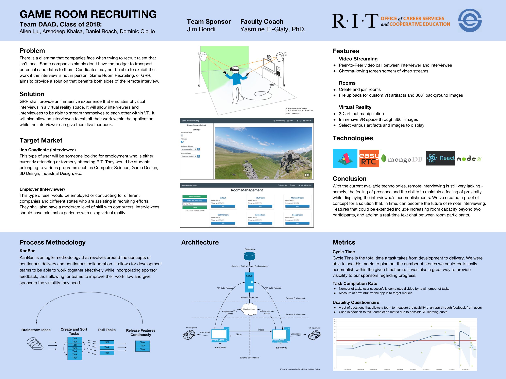
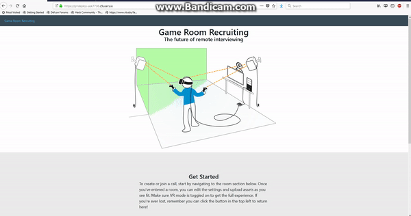
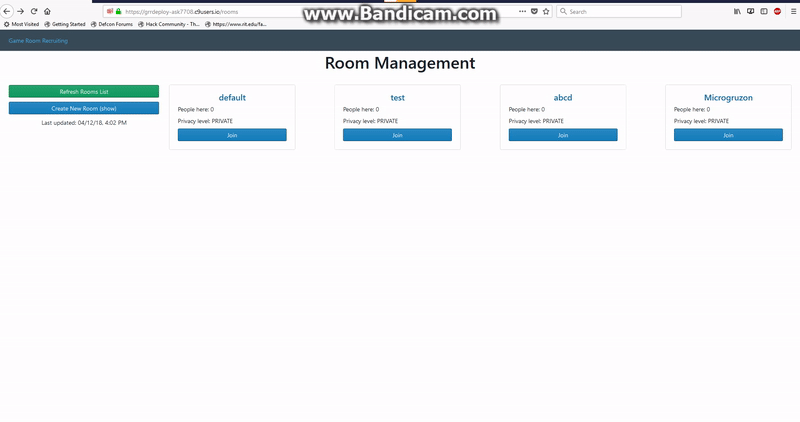
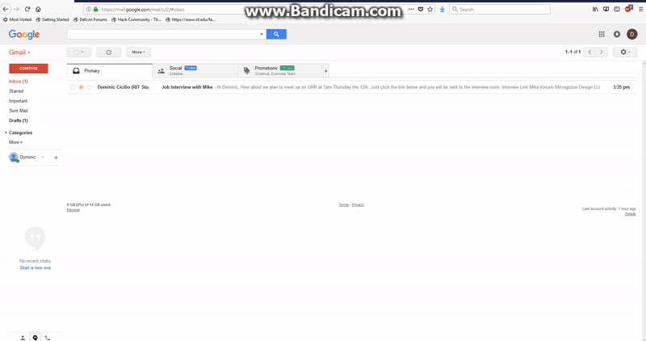
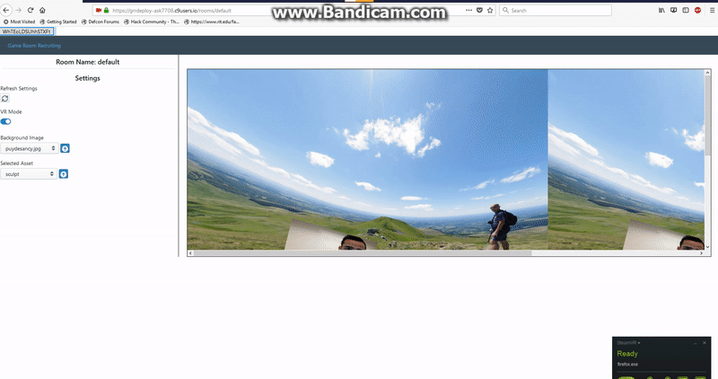
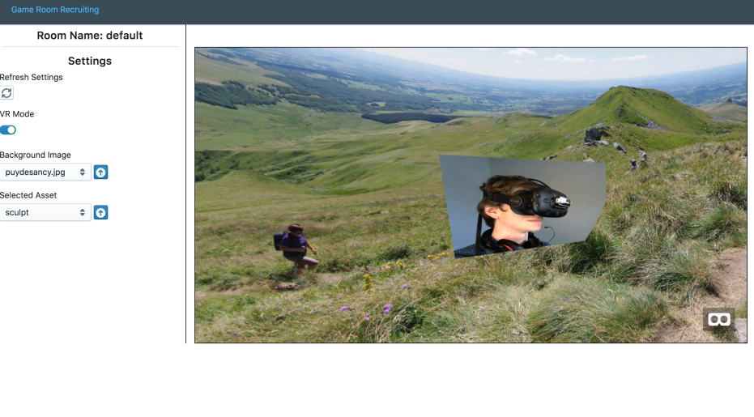
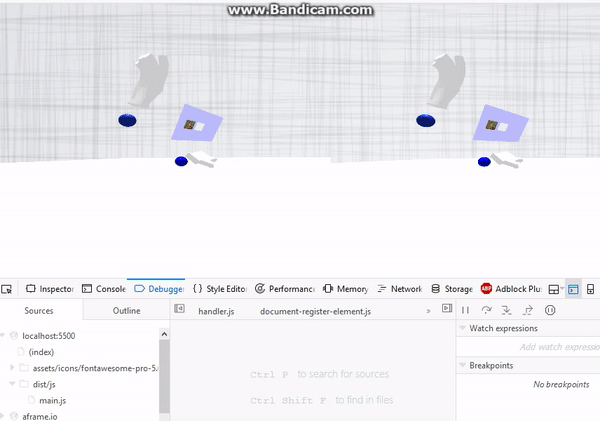

# VR Job Interviewing - Senior Project RIT (2018) 

## Poster Presentation

## GRR DEMO

### Entering the Application

### Room Creation & Entering

### The VR Room

#### The Interview

Student recieving interview email link

Student's perspective

Employeer's perspective

**The Interview Gallery**

.png)

.png)

.png)

.png)

.png)

#### Manipulating Assets

During Development

In App

**Manipulating Assets Gallery**
.png)

.png)

.png)

.png)

.png)

.png)

.png)

.png)

.png)

.png)

.png)

.png)

.png)

.png)
16
.png)

.png)

## Pre-reqs
1) Install nodejs & npm: https://nodejs.org/en/download/package-manager/
2) Make sure git is installed on your machine: https://git-scm.com/book/en/v2/Getting-Started-Installing-Git

## Setup

1. Clone the git repository using the following command

        git clone https://github.com/danielroach9/GRR.git
        
2. Enter the root directory for the project

        ex. cd GRR

3. Install the respective node packages using the following command

        npm install
        
4. Change the 'database.config.js' (located in GRR/grr-server/configs/database.config.js) file's database url variable to your respective database

        
        module.exports = {
        url: '<YOUR_URL_HERE>'
        }
        
5. Change the 'api.config.js' (located in GRR/grr-ui/src/templates/api.config.js) file's url variable to your respective domain

        export const API_URL = '<YOUR_DOMAIN_HERE>';
                ex. export const API_URL = 'http://localhost:8080';
6. Run the following command to build the UI code

        npm run build
       

## Xirsys Stun/Turn Servers

Here is a way to setup the application to work with the Stun/Turn servers (Ice Serves aka Signaling Servers).

1) Create an account at [https://global.xirsys.net]()
1) Login - The homescreen should look something like this: 
1) Create a channel by clicking typing a name and clicking the plus button
1) Scroll down - The following image should look familiar 
1) Take the previous information and plug it into the config.js file:

1) Then in the server.js file, the ice request configs are used to set EasyRTC up with the ice servers:

## How To Run the server locally

1) Open a terminal and run the following. Keep it running. This command runs your server on port 8080 and builds the front-end code.
        
        npm run devstart
        
2) Navigate to http://localhost:8080 and you should see your instance of the application running.

## Tips
EasyRTC and Aframe took a lot of time to learn. We recommend budgeting some time to familiarizing yourself with these frameworks/toolsets.
        
      
